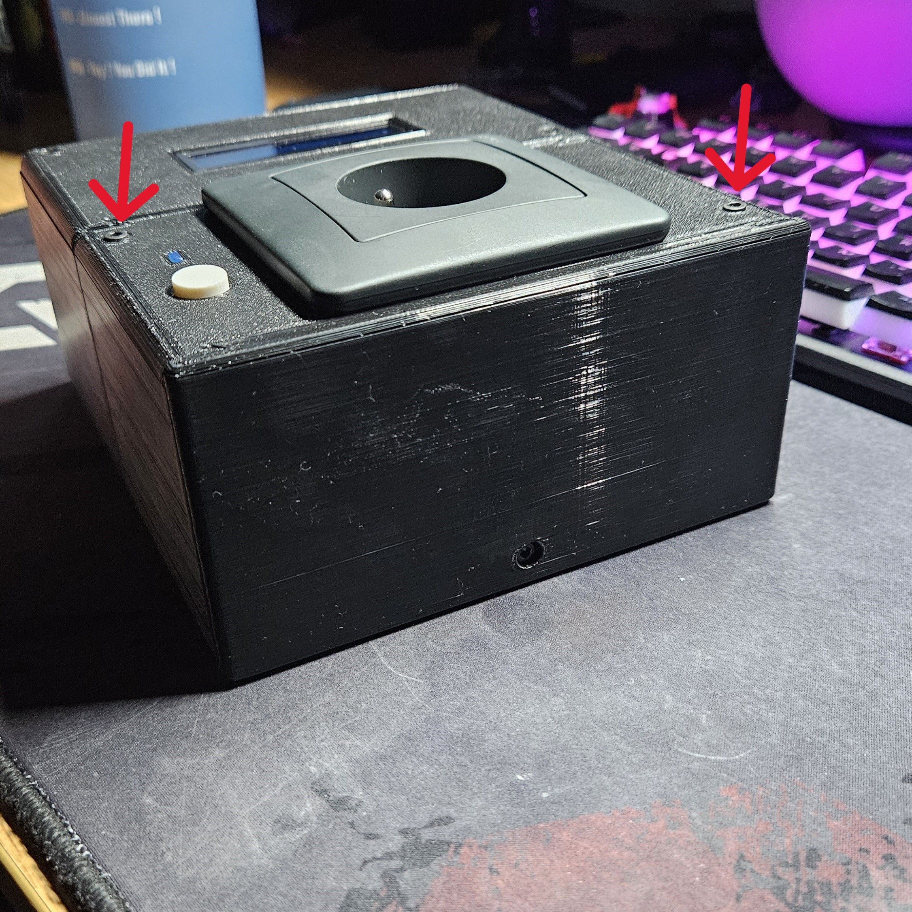

# Postup na přidávání/odebírání přídavných modulů

## Připojení prvního přídavného modulu
- Zařízení musí být vyplé a odpojené od elektřiny

- Vezměte řídící modul a přídavný modul.

- Odšroubujte víko u přídavného modulu.

- Odejměte víko přídavného modulu.

- Připojte přídavný modul k řídícímu modulu.
    - **POZOR** Při připojování přídavného modulu dejte pozor na samotné propojovací konektory, aby nedošlo k jejich poškození. V případě poškození zařízení nebude fungovat správně, či může vzniknout **ZRANĚNÍ**

- Vezměte přiložený šroub a zašroubujte jej do patřičného otvoru pro zajištění přídavného modulu ke zbytku prototypu.  

- Přiložte krytku k druhé straně přídavného modulu.

- Vezměte přiložený šroub a zašroubujte jej do patřičného otvoru pro zajištění krytky modulu.  

- Přiložte zpět víko přídavného modulu.

- Zašroubujte jej.

## Připojení dalšího přídavného modulu do stávajícího prototypu
- Vypněte zařízení a odpojte z něj přívod elektřiny.

- Odšroubujte víko daného přídavného modulu, na který se budete chtít napojit.

- Odšroubujte jistící šroub u krytky daného modulu.

- Odejměte krytku.

- Odšroubujte víko přídavného modulu, který chcete připojit.

- Připojte přídavný modul k zařízení.
    - **POZOR** Při připojování přídavného modulu dejte pozor na samotné propojovací konektory, aby nedošlo k jejich poškození. V případě poškození zařízení nebude fungovat správně, či může vzniknout **ZRANĚNÍ**

- Vezměte přiložený šroub a zašroubujte jej do patřičného otvoru pro zajištění přídavného modulu ke zbytku prototypu.  

- Přiložte krytku k druhé straně přídavného modulu.

- Vezměte přiložený šroub a zašroubujte jej do patřičného otvoru pro zajištění krytky modulu.  

- Přiložte zpět víka přídavnýho modulů.

- Zašroubujte je.

[Zpět na hlavní stránku](./../README.md)