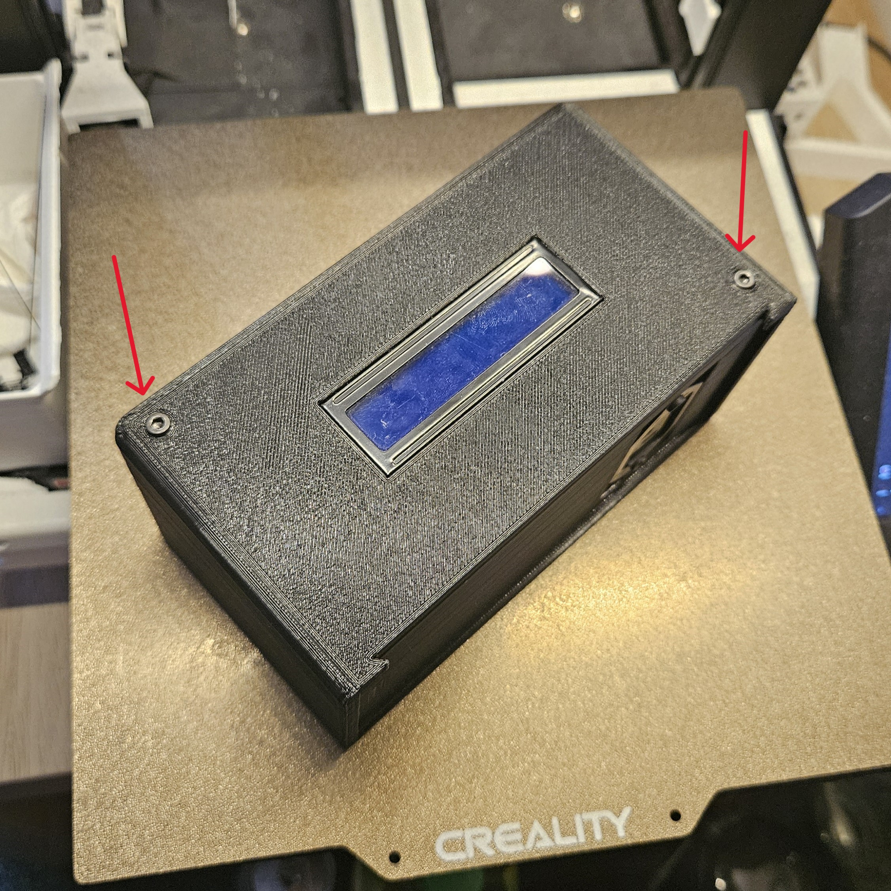
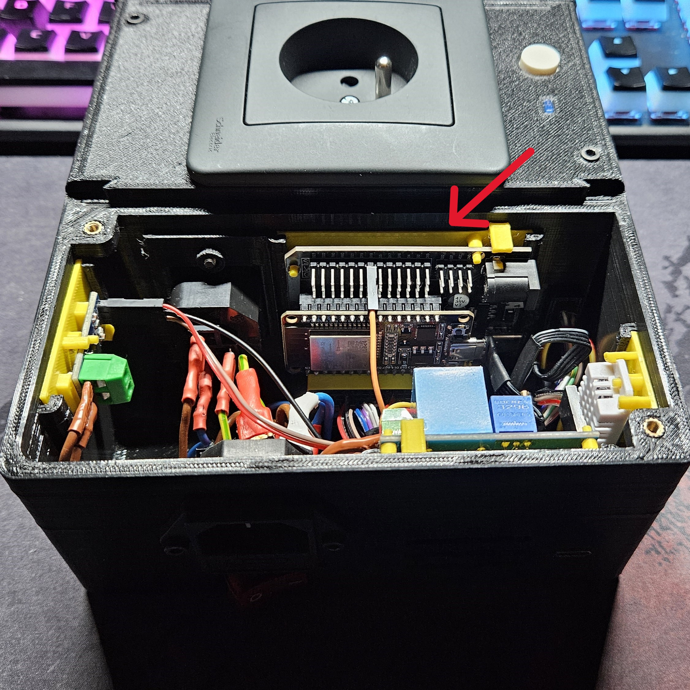
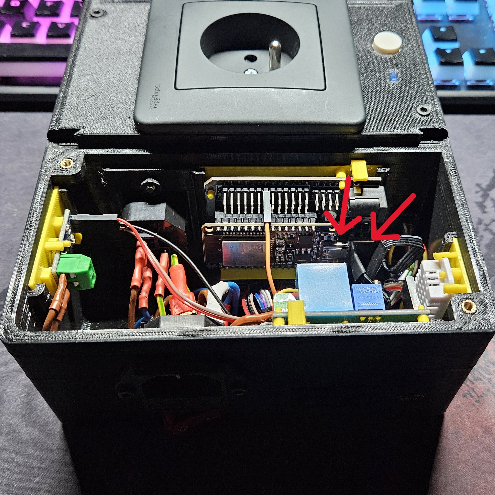

# Výměna řídícího ESP32
TODO - fotky

- Vypněte zařízení a odpojte z něj přívod elektřiny.

- Pokud máte připojené přídavné moduly, odpojte je(pro lepší manipulaci).

- Odšroubujte víko řídícího modulu.

- Odpojte vrchní vodič od ESP.
    - **POZOR** Zapamatujte si jak byl konektor zapojený. Při nesprávném zapojení zařízení nebude fungovat správně, případně může vzniknout poškození na samotném prototypu.

- Opatrně vysuňte přídavnou desku s modulem. 

- Odpojte USB-C konektory vedoucí do ESP a do osazné desky
    - **POZOR** Při složení dbejte na to, aby USB-C konektor vedoucí z transformátoru byl zapojen do osazné desky. A konektor vedoucí z vnější strany se zapojil do ESP.

- Odpojte dolní komunikační konektor a horní komunikační vodič.
    - **POZOR** Zapamatujte si jak byly konektory zapojeny. Při nesprávném zapojení zařízení nebude fungovat správně, případně může vzniknout poškození na samotném prototypu.

- Plně vysuňte přídavnou desku.

- Při výměně ESP32 vyjměte ESP32 z osazné desky. Pokud chcete vyměnit i osaznou desku, vyjměte ji z přídavné desky.

- Pro složení zpět obraťte postup.

[Zpět na hlavní stránku](./../../README.md)