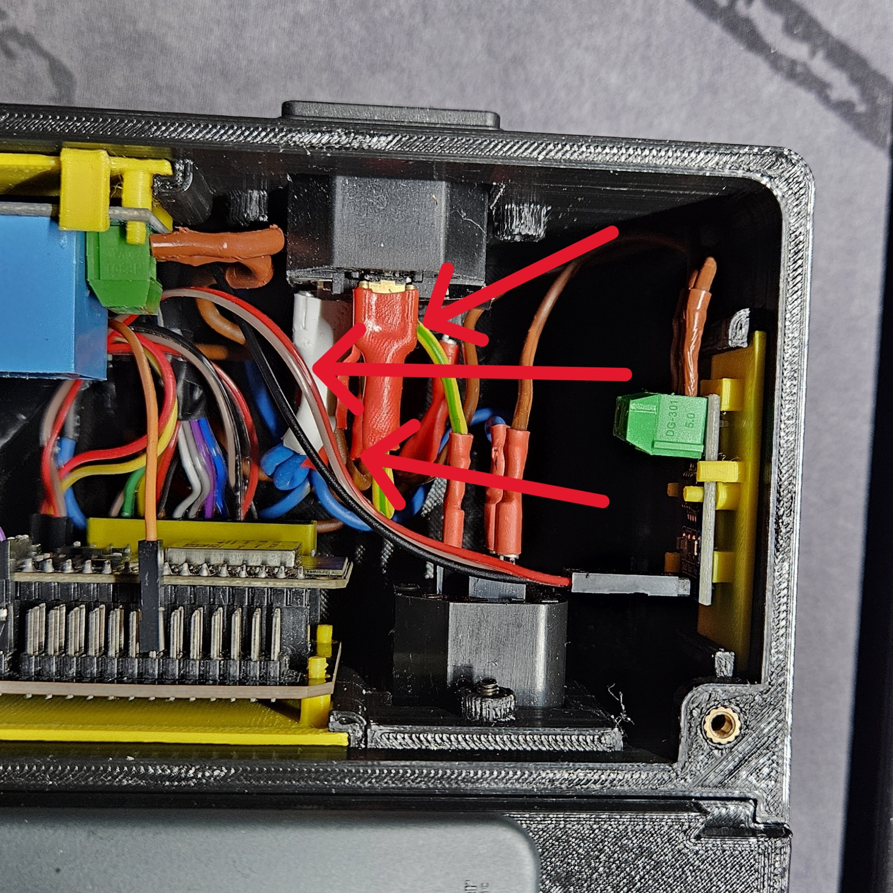
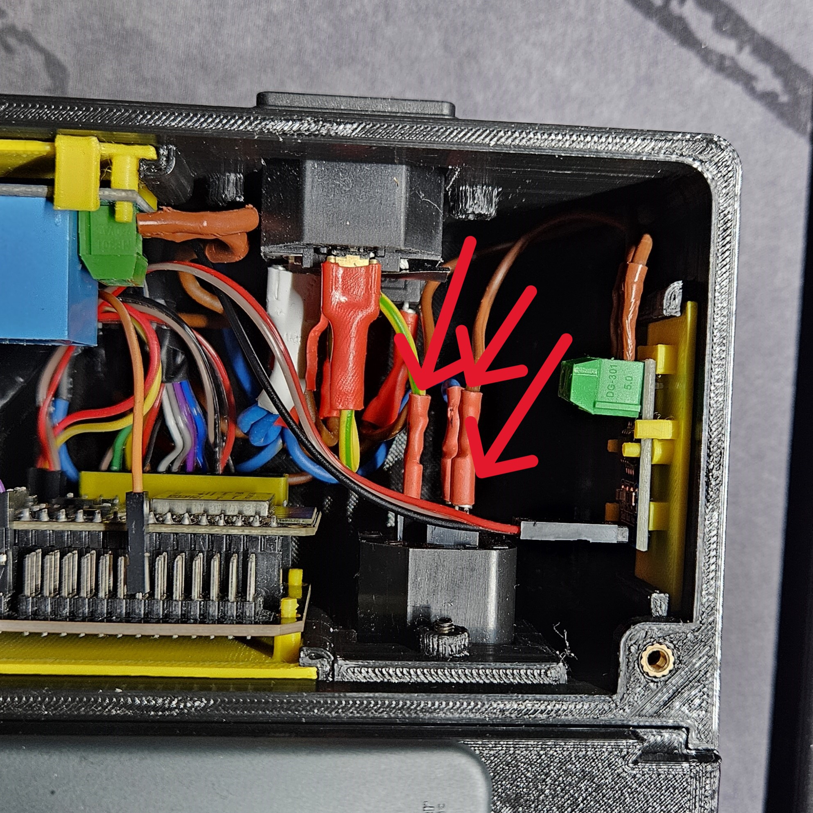

# Výměna konektorů silnoproudové části

## Výměna na řídící jednotce - Přívod elektřiny

- Vypněte zařízení a odpojte z něj přívod elektřiny.

- Pokud máte připojené přídavné moduly, odpojte je(pro lepší manipulaci).

- Odšroubujte víko řídícího modulu.

- Odšroubujte šrouby konektoru.

- Odpojte vodiče z vnitřní strany.
    - **POZOR** Zapamatujte si jak byly vodiče zapojeny. Při nesprávném zapojení zařízení nebude fungovat správně, případně může vzniknout poškození na samotném prototypu, či může dojít ke **ZRANĚNÍ**.

- Vyjměte starý konektor a zapojte nový.

- Pro složení zpět obraťte postup.

## Výměna na řídící jednotce - Propojovací konektor s přídavnými moduly

- Vypněte zařízení a odpojte z něj přívod elektřiny.

- Pokud máte připojené přídavné moduly, odpojte je.

- Odšroubujte víko řídícího modulu.

- Odšroubujte šrouby konektoru.

- Odpojte vodiče z vnitřní strany.
    - **POZOR** Zapamatujte si jak byly vodiče zapojeny. Při nesprávném zapojení zařízení nebude fungovat správně, případně může vzniknout poškození na samotném prototypu, či může dojít ke **ZRANĚNÍ**.

- Vyjměte starý konektor a zapojte nový.

- Pro složení zpět obraťte postup.

## Výměna na přídavném modulu - propojovací konektor s řídícím/přídavným modulem
TODO - fotky

- Vypněte zařízení a odpojte z něj přívod elektřiny.

- Pokud máte připojené přídavné moduly, odpojte je.

- Odšroubujte víko přídavného modulu.

- Vyjměte konektor směrem ven.

- Odšroubujte víko konektoru.

- Povolte šrouby na jednotlivých pinech a následně vyjměte vodiče.
    - **POZOR** Zapamatujte si jak byly vodiče zapojeny. Při nesprávném zapojení zařízení nebude fungovat správně, případně může vzniknout poškození na samotném prototypu, či může dojít ke **ZRANĚNÍ**.

- Pro složení zpět obraťte postup.

## Výměna na přídavném modulu - propojovací konektor s dalším přídavným modulem

- Postup je totožný jako u [řídícího modulu](#výměna-na-řídící-jednotce---propojovací-konektor-s-přídavnými-moduly).

[Zpět na hlavní stránku](./../../README.md)