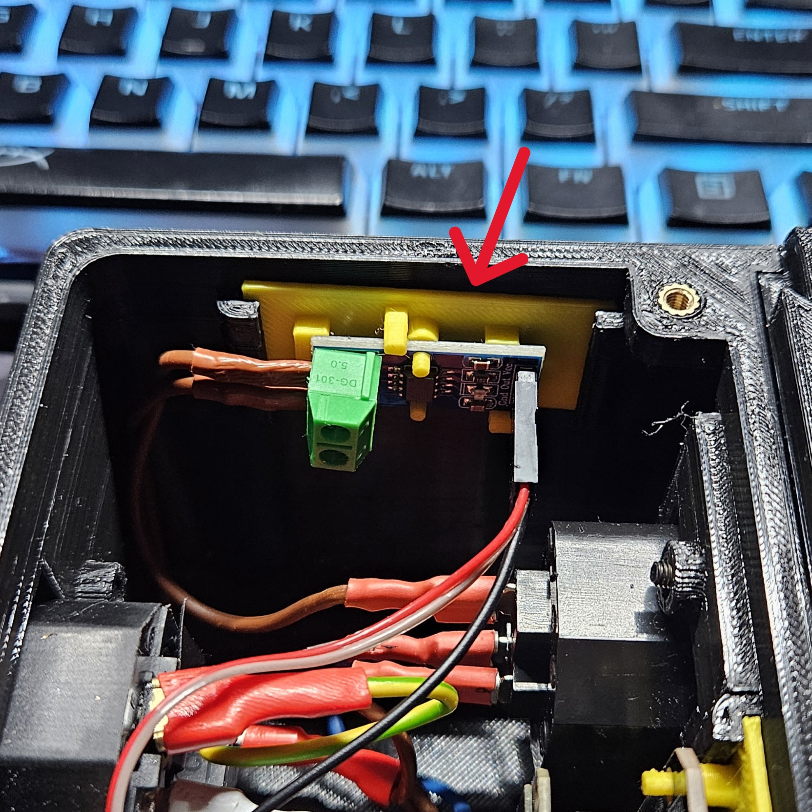
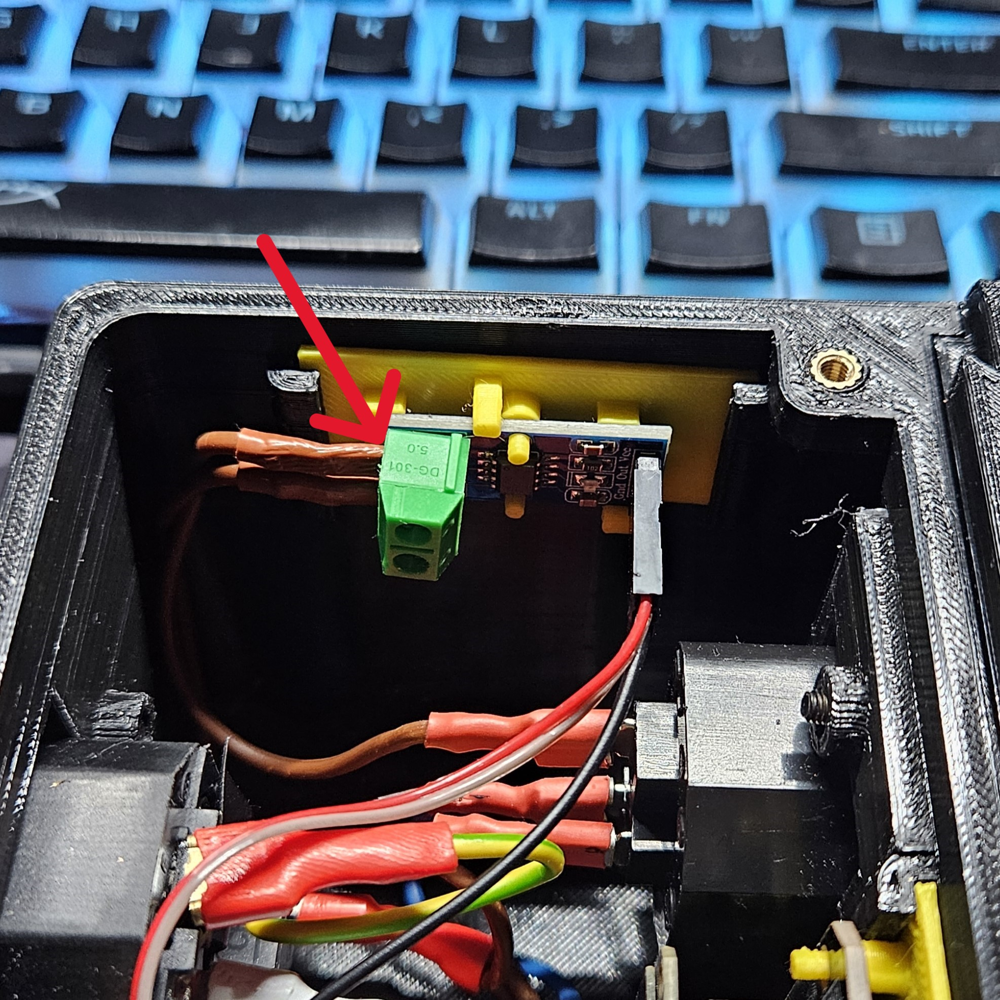

# Výměna senzoru pro měření proudu

- Vypněte zařízení a odpojte z něj přívod elektřiny.

- Pokud máte připojené přídavné moduly, odpojte je(pro lepší manipulaci).

- Odšroubujte víko řídícího modulu.

- Vyjměte jisticí desku pro senzor.

- Vyjměte senzor z řídícího modulu.

- Odpojte konektor od senzoru.
    - **POZOR** Zapamatujte si jak byl konektor zapojený. Při nesprávném zapojení senzoru zařízení nebude fungovat správně, případně může vzniknout poškození na samotném prototypu.

- Odpojte konektor od vodiče od senzoru.
    - **POZOR** Zapamatujte si jak byl konektor zapojený. Při nesprávném zapojení senzoru zařízení nebude fungovat správně, případně může vzniknout poškození na samotném prototypu.

- Pro složení zpět obraťte postup.

[Zpět na hlavní stránku](./../../README.md)