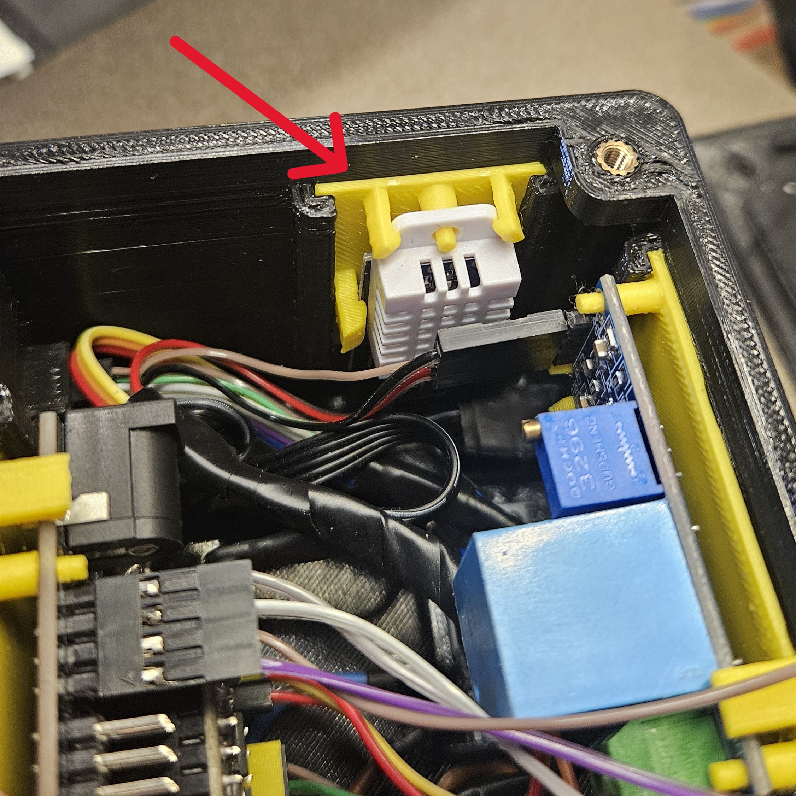

# Výměna senzoru pro měření vlhkosti a teploty

- Vypněte zařízení a odpojte z něj přívod elektřiny.

- Pokud máte připojené přídavné moduly, odpojte je(pro lepší manipulaci).

- Odšroubujte víko řídícího modulu.

- Vezměte víko s displejem a odpojte konektor od displeje.
    - **POZOR** Zapamatujte si jak byl konektor zapojený. Při nesprávném zapojení zařízení nebude fungovat správně, případně může vzniknout poškození na samotném prototypu.
    - **POZOR** Může se stát, že se Vám ESP32 odpojí od výsuvné desky. V tomto případě jej zasuňte zpátky do desky a pokračujte dalším krokem.

- Vysuňte přídavnou desku se senzorem. 

- Odpojte konektor od senzoru.
    - **POZOR** Zapamatujte si jak byl konektor zapojený. Při nesprávném zapojení senzoru zařízení nebude fungovat správně, případně může vzniknout poškození na samotném prototypu.

- V případě výměny desky odpojte senzor od přídavné desky

- Pro složení zpět obraťte postup.

[Zpět na hlavní stránku](./../../README.md)
