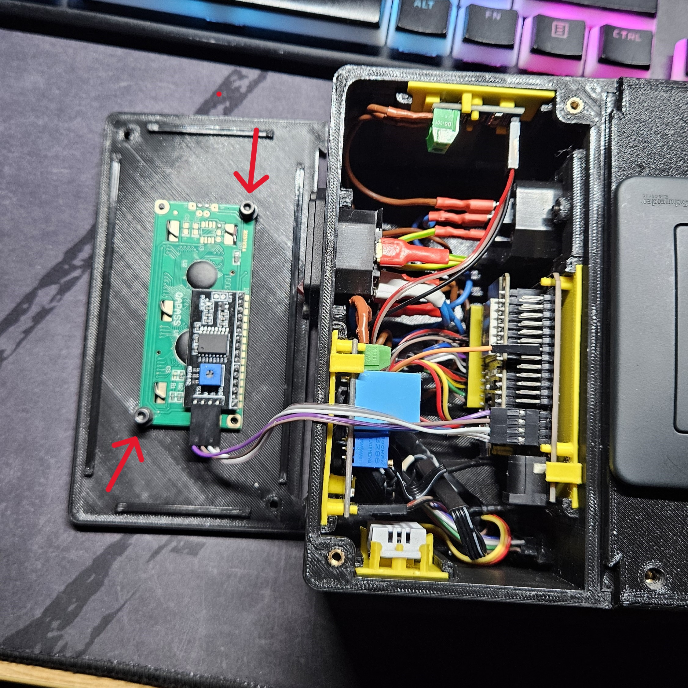

# Výměna senzoru pro měření vlhkosti a teploty

- Vypněte zařízení a odpojte z něj přívod elektřiny.

- Pokud máte připojené přídavné moduly, odpojte je(pro lepší manipulaci).

- Odšroubujte víko řídícího modulu.

- Vezměte víko s displejem a odpojte konektor od displeje.
    - **POZOR** Zapamatujte si jak byl konektor zapojený. Při nesprávném zapojení zařízení nebude fungovat správně, případně může vzniknout poškození na samotném prototypu.

- Odšroubujte jistící šrouby od displeje.

- Vyjměte displej z víka.

- Pro složení zpět obraťte postup.

[Zpět na hlavní stránku](./../../README.md)