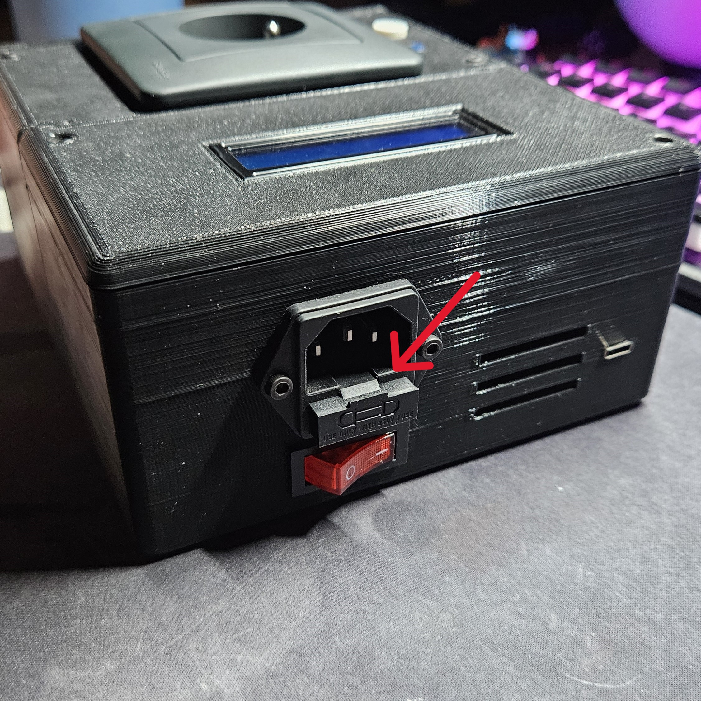

# Výměna silnoproud pojistky

- Vypněte zařízení a odpojte z něj přívod elektřiny.

- Vysuňte "šuplíček" uprostřed konektoru.

- Vyjměte pojistku.

- Pro složení zpět obraťte postup.

[Zpět na hlavní stránku](./../../README.md)