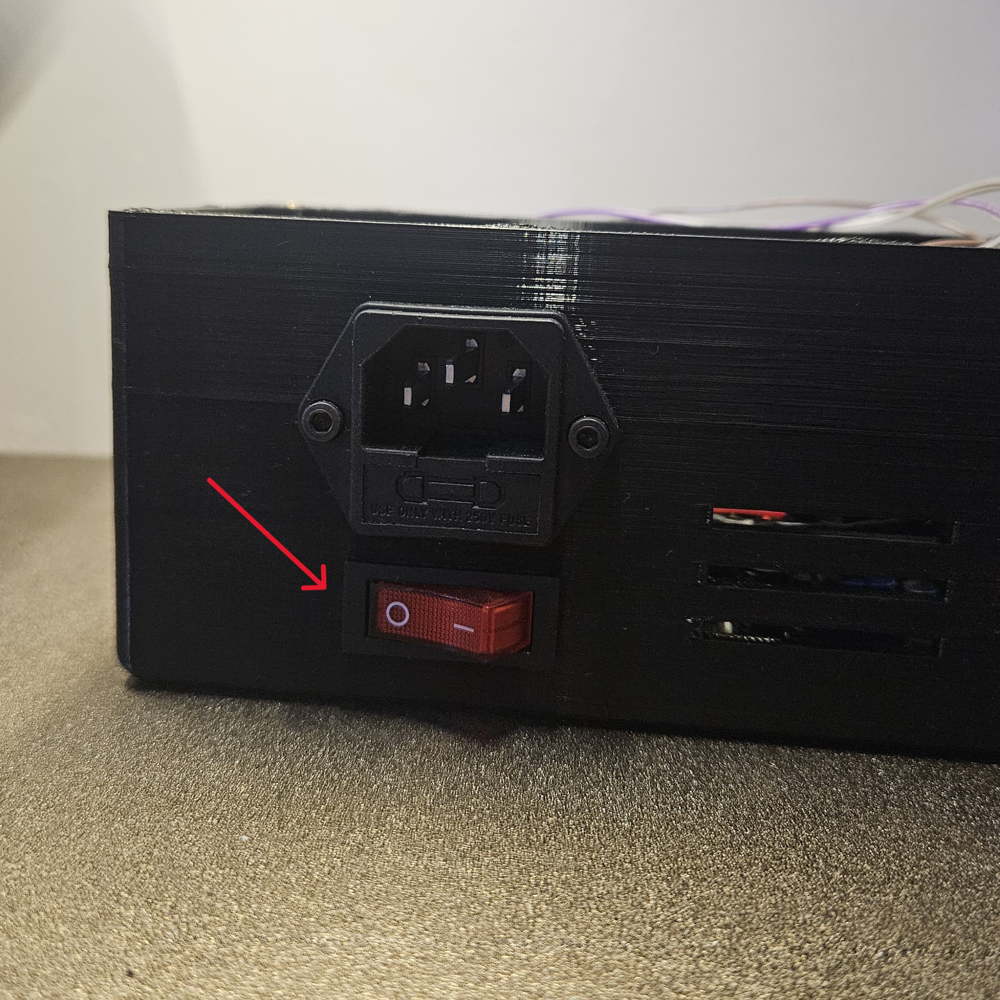

# Výměna senzoru pro měření napětí

- Vypněte zařízení a odpojte z něj přívod elektřiny.

- Pokud máte připojené přídavné moduly, odpojte je(pro lepší manipulaci).

- Odšroubujte víko řídícího modulu.

- Vyjměte přídavnou desku se senzorem.

- Odpojte silnoproudové vodiče.
    - **POZOR** Zapamatujte si jak byly vodiče zapojeny. Při nesprávném zapojení zařízení nebude fungovat správně, případně může vzniknout poškození na samotném prototypu, či může dojít ke **ZRANĚNÍ**.

- Odpojte konektor od senzoru.
    - **POZOR** Zapamatujte si jak byl konektor zapojený. Při nesprávném zapojení senzoru zařízení nebude fungovat správně, případně může vzniknout poškození na samotném prototypu.

- Odpojte senzor od přídavné desky

- Pro složení zpět obraťte postup.

[Zpět na hlavní stránku](./../../README.md)